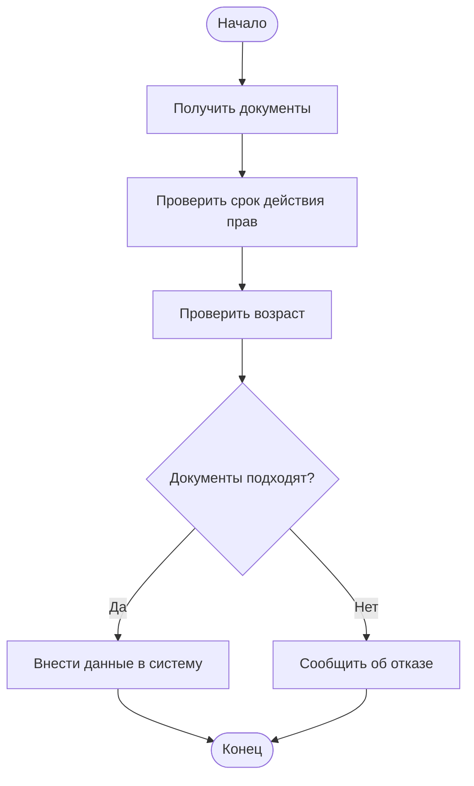

# Flowchart: Проверка документов клиента

```mermaid
flowchart TD
    A([Начало]) --> B[Получить документы]
    B --> C[Проверить срок действия прав]
    C --> D[Проверить возраст]
    D --> E{Документы подходят?}
    E -->|Да| F[Внести данные в систему]
    E -->|Нет| G[Сообщить об отказе]
    F --> H([Конец])
    G --> H
```