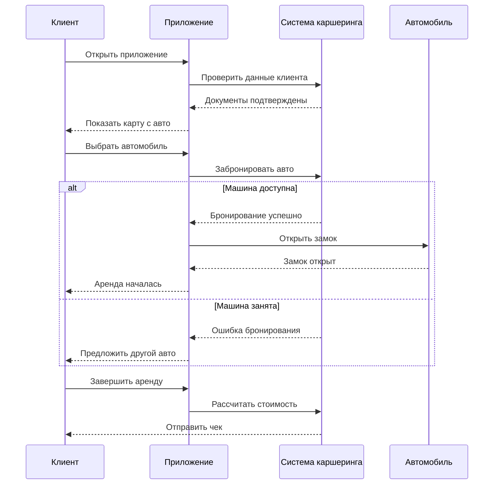

# Sequence Diagram: Процесс аренды автомобиля

```mermaid
sequenceDiagram
    participant K as Клиент
    participant P as Приложение
    participant S as Система каршеринга
    participant A as Автомобиль

    K->>P: Открыть приложение
    P->>S: Проверить данные клиента
    S-->>P: Документы подтверждены
    P-->>K: Показать карту с авто
    K->>P: Выбрать автомобиль
    P->>S: Забронировать авто

    alt Машина доступна
        S-->>P: Бронирование успешно
        P->>A: Открыть замок
        A-->>P: Замок открыт
        P-->>K: Аренда началась
    else Машина занята
        S-->>P: Ошибка бронирования
        P-->>K: Предложить другой авто
    end

    K->>P: Завершить аренду
    P->>S: Рассчитать стоимость
    S-->>K: Отправить чек
```