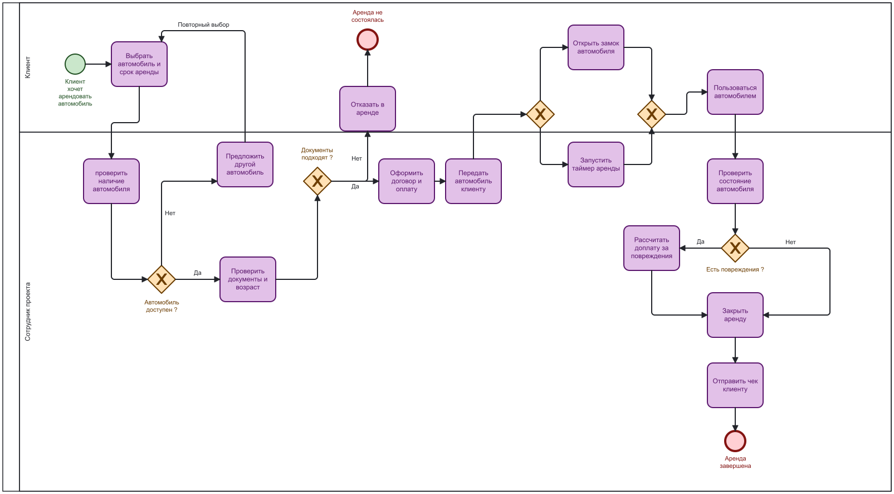
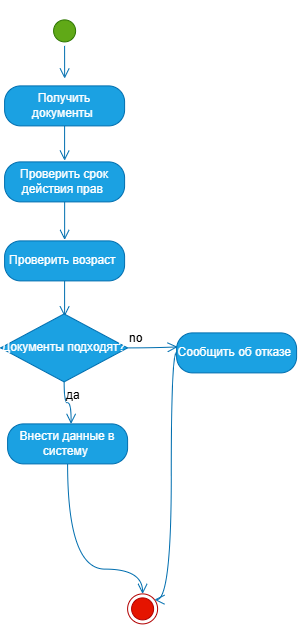
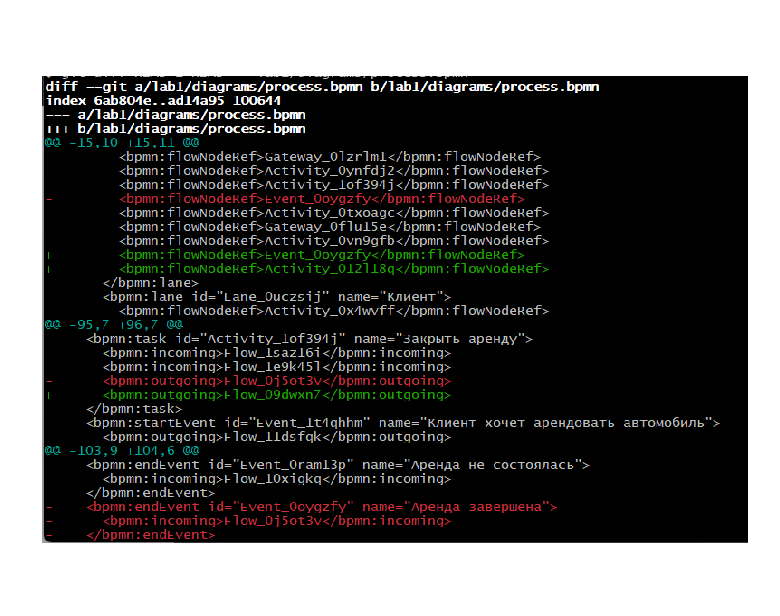
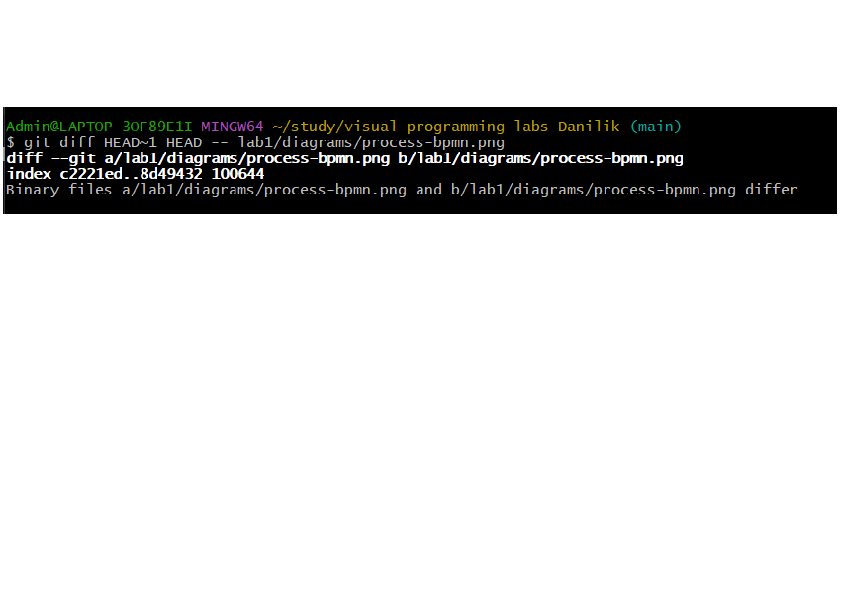

# Отчёт по лабораторной работе №1

## Описание процесса
В лабораторной работе смоделирован процесс краткосрочной аренды автомобиля через сервис каршеринга. Процесс охватывает полный цикл: от авторизации клиента в приложении и проверки документов до завершения поездки и расчёта стоимости.

## Диаграммы

### BPMN-диаграмма

Исходник: [process.bpmn](diagrams/process.bpmn)

### UML Activity Diagram

Исходник: [activity.drawio](diagrams/activity.drawio)

### Sequence Diagram
Код: [sequence.md](docs/sequence.md)

### Flowchart
Код: [flowchart.md](docs/flowchart.md)

## Сравнение diff для текстового и бинарного форматов

### Текстовый формат (.bpmn, XML)
Виден построчный diff — добавленные строки `+` и удалённые строки `-`.

### Бинарный формат (.png)
Git показывает только факт различия, без деталей.

## Выводы
В ходе лабораторной работы я освоила базовые команды Git: инициализацию репозитория, коммиты с осмысленными сообщениями, отправку изменений на GitHub по SSH. Научилась создавать диаграммы в четырёх нотациях: BPMN, UML Activity, Sequence и Flowchart. Главный практический вывод — Git по-разному работает с текстовыми и бинарными файлами: в текстовых (например, .bpmn, XML) видны конкретные изменённые строки, а в бинарных (.png) — только сам факт различия. Это важно учитывать при работе с графикой в репозиториях.